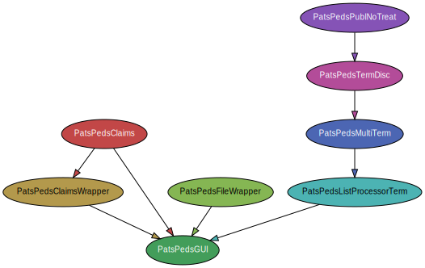

## PatsPeds Toolset ##

A friendly toolset to access **USPTO** PEDS system.

### Functions ###

_PatsPedsGUI.py_: **Top Level App with GUI** for *all* tools

_PatsPedsClaims.py_: Takes an appl. Id and download the latest claims (cli)

_PatsPedsClaimsWrapper.py_: Takes a pre-grant publication number or a patent number and 
returns on the cli the according term extension days. But used from PatsPedsGUI it also may return
the latest claims or the combination of term extension days and presence of a terminal
disclaimer (True or False)

_PatsPedsFileWrapper.py_: Takes an application ID and download the **full file wrapper** from USPTO

_PatsPedsListProcessorTerm.py_: A list processor which takes a xlsx-File containing 
a column called _"PN"_ with publication numbers (pre-grant or patent publication numbers),
checks **for each publication** a term extension in days as well as the presence of 
a terminal disclaimer, and writes the results to a new xlsx file. File management is done
via file dialogs. 

_PatsPedsMultiTerm.py_: Simple helper function to _PatsPedsListProcessorTerm.py_, which takes 
a list of publication numbers and invokes for each number _PatsPedsTermDisc.py_.

_PatsPedsListProcessorTerm.py_: Actual modul using requests library to get for each publication number (in a column 
called 'PN' of an Excel spreadsheet) the according application Id and subsequently the term extension in days and the 
presence of a terminal disclaimer. Prior to requesting the application Id it treats each publication number with 
_PatsPedsPublNoTreat.py_ to get it in a correct format for USPTO PEDS.

_PatsPedsPublNoTreat.py_: helper function to get the number format correctly.

svg prepared using `pydeps PatsPedsGUI.py --max-bacon 5 --exclude pandas requests numpy`

## Usage ##
Clone the repo or download all files to a directory of your choice. 
Make sure you have Python and all dependencies installed (ref. below).
Execute _PatPedsGUI.py_.
Please not that this is an early incarnation of the toolset. It may contain bugs and exhibit behavior which
may not seem obvious. 

Tested with `Python 3.9`

Dependencies: `Pandas, PySimpleGUI, Requests, and JSON` 

Many _thanks_ to the authors/maintainers of these libraries and to the authors/maintainers of **Python**!

April 25, 2021  

(c) 2021 Vinz Frauchiger, other rights may be applicable invoked by the use of Python and the dependencies.

